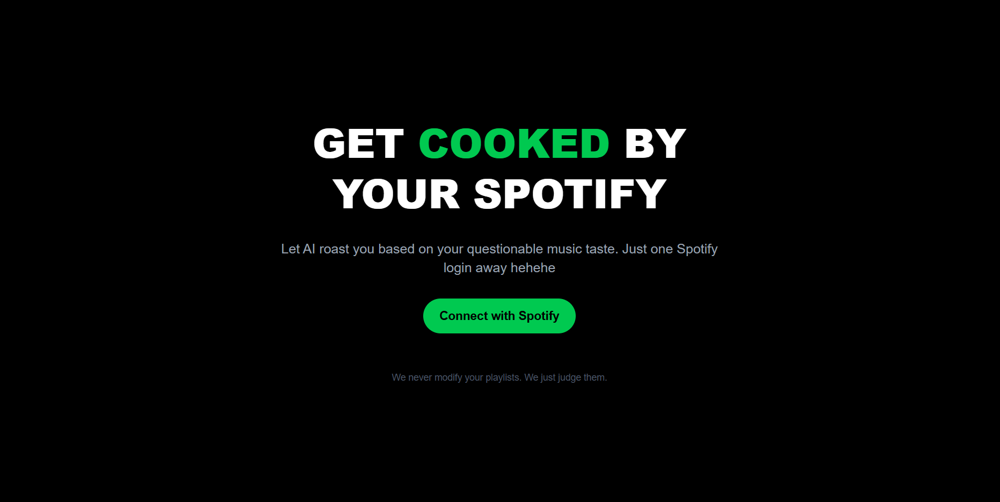
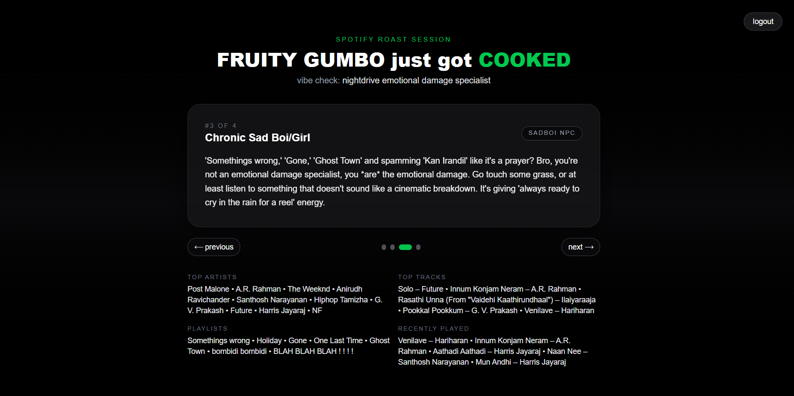

# GetCooked

GetCooked is a Spotify-powered roast generator. Users authenticate with Spotify, the app analyzes their listening data, and produces a set of humorous, Gen-Z–style roast messages. It includes an animated carousel UI, logout flow, and fallback roast generation if AI providers fail.

## Features

- Spotify OAuth authentication
- Fetches top artists, tracks, playlists, and recent listening history
- Generates roasts using AI or offline fallback logic
- Animated carousel interface for roast display
- Clean dark-themed UI

## Screenshots







## Running Locally

Install dependencies:

```
npm install
```

Start development server:

```
npm run dev
```

Open:

```
http://localhost:3000
```

## Environment Variables

Create a `.env` file and include:

```
SPOTIFY_CLIENT_ID=
SPOTIFY_CLIENT_SECRET=
SPOTIFY_REDIRECT_URI=
GEMINI_API_KEY=
```

## Production Notes

- Spotify apps in development mode require test users to be added manually.
- Deployable on Vercel.
- LocalAI or Gemini can provide roast generation.

## License

MIT License.
